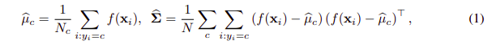
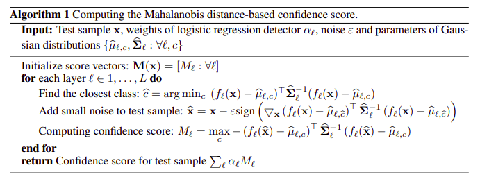
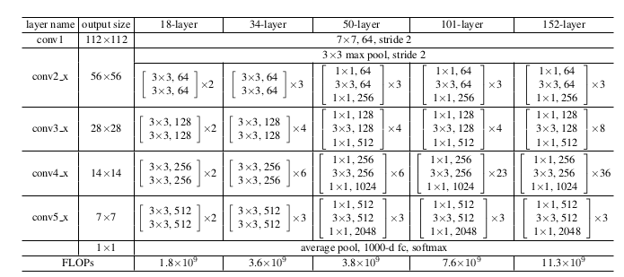

# INTRODUCTION

Implementation of paper : https://arxiv.org/pdf/1807.03888.pdf.

Some ideas are also taken from here : https://arxiv.org/pdf/2002.11297.pdf

## CLASSIFIER TRAINING
The code structure, parameters are totally inspired (and lot of them copied) from here : https://github.com/pytorch/vision/tree/main/references/classification.

More info about the methods (used in training the classifier) are given in this blog : https://pytorch.org/blog/how-to-train-state-of-the-art-models-using-torchvision-latest-primitives/

## OOD DETECTION

Here I am implementing the idea from this paper : https://arxiv.org/pdf/1807.03888.pdf

So considering base model as `resnet` (starting from imagenet weights), a feature vector of shape `(C, H, W)` is extracted after each skip connection. A global average pooling 
in then applied to get the embedding from each layer with shape `(C, 1)`.

After the training is completed for each layer, train embeddings are collected. Mean (for each class) and tied-covariance (this will be same for all the classes) for each layer will be calculated as follows (see equation 1 of the paper):

where `f(x)` is the embedding. As mentioned this is done for each layer and means, tied covariance are stored.

Now for a test sample, the score is calculated using the Algorithm 1 of the paper.

Note that as of now I have not implemented noise perturbation of the test sample. As per the paper, $\alpha_{l}$ are calculated by fitting a logisitic regression model on a small validation set with both in-distribution and out-distribution samples.

As we don't have access to out-distribution at the time of training, the final score is calculated as average of scores from each layer. This idea is taken from this paper : https://arxiv.org/pdf/2002.11297.pdf

So the final score will be

$$
s = \frac{1}{L} \sum_{l} M_{l}
$$

where $L$ denotes number of layers.

So if we consider base model as `resnet-34` and embedding is constructed by taking the feature vector after each skip connection, we will get $3 + 4 + 6 + 3 = 16$ layers. Please refer to below resnet layer belows (taken from the original paper.)

